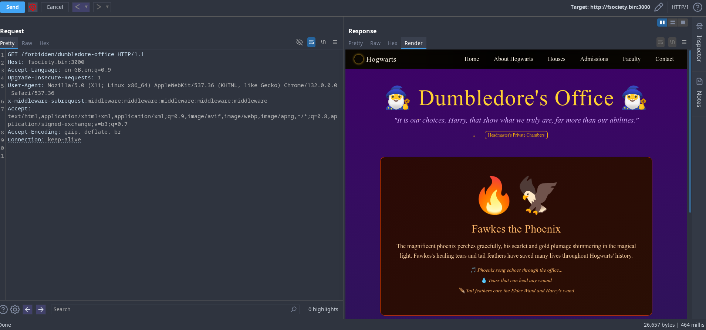
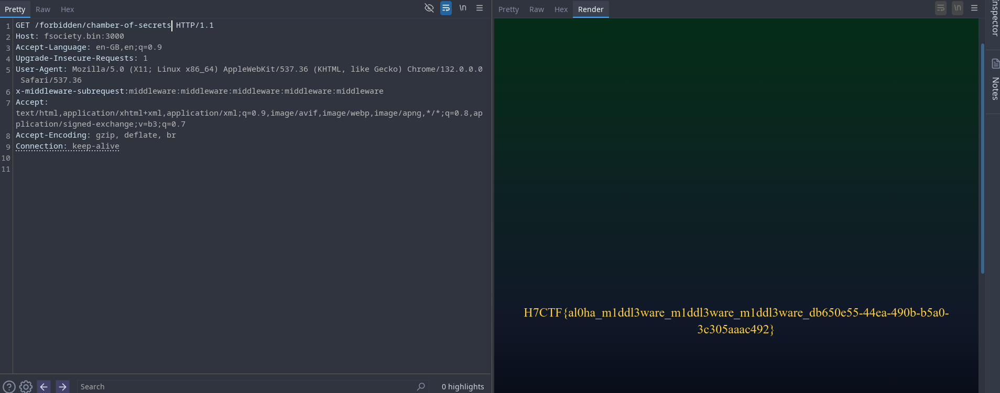

# Alohomora

**Points:** 2000

**Author:** psychoSherlock

---

## Description

You’re a muggle-born who just got access to the dev environment of the Hogwarts School website. It was made using a new magic AI of version 0 by a magical consortium. While exploring, you identify that the magic this consortium used had some security flaws recently. The lazy developer never patched it either. Can you identify the issue to trick the wizards and unlock the chamber of secrets?

---

## Writeup & Solution

Spin up the instance. You will be greeted with the Hogwarts website. The website seems too beautiful to be built by humans (even I don't know how it works). It's built by an AI. That's what the description says. An AI. Of version 0? V0?

Look at Wappalyzer—it's using Next.js version 14.2.16.

As the challenge description says, they used an AI. The AI is V0, developed by Vercel (which also developed Next.js). And the description mentions that they had a flaw recently.

Yeah, Next.js had a severe flaw recently: CVE-2025-29927. You would know if you watched the news or researched. Not GUESS WORK GUYS, idk why people asked me that.

Read more: [Next.js Middleware Auth Bypass](https://securitylabs.datadoghq.com/articles/nextjs-middleware-auth-bypass/)

Anyway, going through the website you will see a button at Dumbledore:


which leads to a forbidden page. But if you observe closely, it was a redirect from: `forbidden/dumbledore-office`.

Also, there is no backend login in the login page. It's just a login page. idk if anyone tried to brute force or something. Anyway, we got what we wanted to bypass.

Now do your alohomora from the CVE:

`x-middleware-subrequest:middleware:middleware:middleware:middleware:middleware`

in the header and you will get the Dumbledore office:



Looking at the other links, you will see a link to the chamber of secrets. Pass the same alohomora there and:



```
H7CTF{al0ha_m1ddl3ware_m1ddl3ware_m1ddl3ware_db650e55-44ea-490b-b5a0-3c305aaac492}
```
