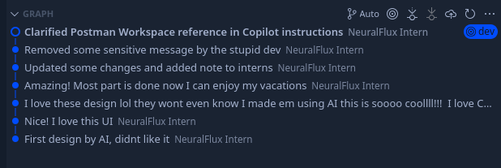
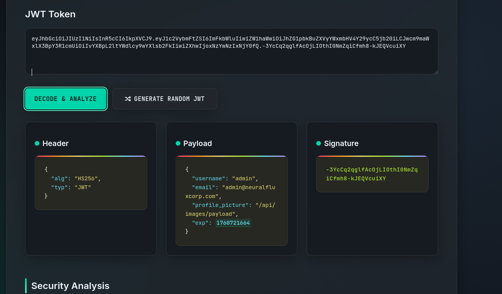
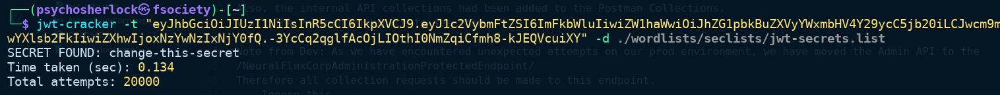

# NeuralFluxCorp

**Points:** 2500

**Author:** psychoSherlock

---

## Description

Another day, another "AI" startup — NeuralFluxCorp is gearing up to launch their product, proudly powered by marketing buzzwords and pure optimism. You’ve had enough of these so-called innovators fooling everyone with the same “deep learning” tricks, usually cooked up by a team of over-caffeinated interns who think “security” is just an optional add-on. Time to teach them a lesson; let their fall be a classic joke before their launch even begins.

---

## Hints

**Hint 1:** You may have to look outside the box. Don't know the way? Why don't u ask the postman?  
Cost: 0

**Hint 2:** Did you know that JWT tokens can be edited? After all they are just base64 encoded data signed with a secret chosen by the interns!  
Cost: 50

**Hint 3:** Look closely. The interns left a contract file which contains juicy info!  
Cost: 150

---

## Writeup & Solution

This one I've had really short time like 2 days to build. I wanted to make it really hard and challenging. But didn't know which vuln to go with, especially because we had the Docker container limitation for dynamic flags. While writing my last exam I realized the vulnerability I should try. But still thought as it's international, peeps would crack it. So decided to chain it with a backstory.

### 1. Reconnaissance

Opening the web you will see the NEURAL FLUX is coming soon. Doing Gobuster you will see that it has .git directory. You have to use other wordlists. I noticed some people only tried the `directory-list-2.3-medium.txt` and just stopped.

Anyways, the .git doesn't have directory listing enabled. But u can access the .git/HEAD. You can use any git dumping tools to dump it. I recommend [git-dumper](https://github.com/arthaud/git-dumper) or [GitTools](https://github.com/internetwache/GitTools).

Dump the repo and look through it. Notice that its on `prod` branch. List branches and you will see another `dev` branch. Inside the `dev` branch look at the files. Its the dev files. notice the `.github/copilot-instructions.md` . If you look through the logs u will see suspicious logs:



Looking through the logs the following juicy info can be seen:

```
Also, the internal API collections had been added to the Postman Collections.
Visit The Postman Workspace to see them.

Note from Dev: As we have encountered unexpected attempts on our prod environment, we have moved the Admin API to the
/NeuralFluxCorpAdministrationProtectedEndpoint/
Therefore all collection requests should be made to this endpoint.
--- Ignore this ---
```

The info talks about the internal endpoint as well as something else. A Postman workspace. For those who dont know, the post man is a API toolkit used by developers. Some devs leak informations on their collections publicly. this can be seen on live assets.
Go to https://www.postman.com/ and search for `NeuralFluxCorp` and you will see.
https://www.postman.com/neuralfluxcorp-9740244/neuralfluxcorp/collection/wmtpwi5/neuralfluxcorp-intern-collection

You can see the leaked JWT token. If you observe the requests such as the admin login you can also notice the API Header required. This header is required to communicate with the API

---

### 2. JWT Analysis

If you try the JWT token its expired. But it doesnt say its invalid. IF you think about this, the token is valid but not working now.
Analyze the token using any website such as [jwt.io](https://jwt.io/) or [token.dev](https://token.dev/).
Personally I love to use [jwtauditor.com](https://jwtauditor.com/) (kudos to the devs of this). It has all the tools you need.



Now you notice the exp? its the expiry time. If you can modify this u will get the flag. but wait! JWT is protected by a secret!

---

### 3. Brute-Forcing the JWT Secret

So try to brute force that secret. You can either use [jwtauditor.com](https://jwtauditor.com/) to do that or [jwt-cracker](https://github.com/lmammino/jwt-cracker/)



BTW use a wordlist for jwt's not everything works with rockyou.txt

Now you got the token. Edit the expiry time to a time in future so that u can use the token, and sign it using the newly found secret:
`change-this-secret`

---

### 4. Admin Panel Access

Now, go to the endpoint you found previosly

You see a login page for admin. Who cares. Look through `login.js` code and see that it needs an `adminToken` in localStorage for logging in!

Great! do that, using the token.

On the admin page, go through the dashboard. Most of the funcitons are kept there to piss you off.

Except the messages. Look at what `psychoSherlock` said:

```
Thanks for the heads up. I've successfully migrated the server to Docker. The issues are pending to be fixed. Therefore all sensitive data were moved to /.dockerenv for protection purposes until we patch the vulnerabilities.
```

---

### 5. Exploiting XXE via SVG Upload

Great! Another juicy info? Maybe that contains the flag? but we need an LFI
if you go to the settings u would see an image upload endpoint

Btw you have a API contract at /api/contract
if you used that u know that this endpoint only accepts svg.
Wait? Why SVG?

SVG is just plain old XML. And what comes with XML? XXE?

here is the payload:

```xml
<?xml version="1.0" encoding="UTF-8"?>
<!DOCTYPE svg [
  <!ENTITY xxe SYSTEM "file:///.dockerenv">
]>
<svg xmlns="http://www.w3.org/2000/svg" width="400" height="200">
  <text x="10" y="20" font-size="12" fill="black">&xxe;</text>
</svg>
```

And you will get the flag:

```
H7CTF{FR0m_m1sc0nfigs_4ND_API_ATT4CK5_T0_XX3_1nj3ctioN_154ad7d0-b1f8-49f6-89a2-294141727a71}
```

---

Thank you for playing ya'll. I hope you like it 😇
