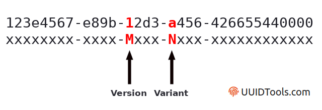
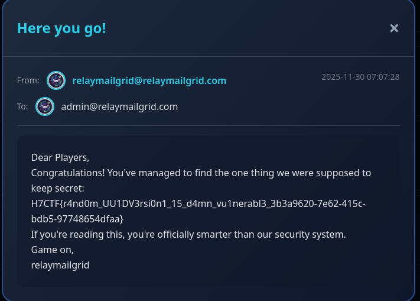

# RelayMailGrid

**Points:** 2500

**Author:** psychoSherlock

---

## Description

These script kiddies created a cool project (so they say) for their final year. It's a mail client that doesn't use any mail server.

"Who needs a mail server when we can create our own?" - Said the nerds.

True, it's:

- Lightning fast
- Reliable
- It's secure

Or... is it??

---

## Hints

**Hint 1:** There is one more account apart from the accounts you have created. Your goal is to take over that account by chaining more than one vulnerabilities.  
Cost: 0

**Hint 2:** Things that may seem random are not truly random. What we call random is merely what we can't yet predict. It's just an illusion by some algorithms we just don't know yet.  
Cost: 500

---

## Details

This is based on a bug that I've found recently during my security testings at where I did internship. It was pretty interesting to me so I thought might be fun and insightful.

**Congratulations to @0xgodson of Team Flagsomnia for solving this challenge!**

---

## Writeup & Solution

### 1. Initial Exploration

When we initially use the mail server we have options to register accounts as you wish. You can also either login or click on forget password.

We also have Captcha everywhere. Making it not possible to bypass the login via bruteforce.

Or so you thought. But the captcha doesn't have a recheck feature. Meaning that it will be valid for approx 3-5 minutes.

If we logged in, we can have an interface where we receive a welcome email from `relaymailgrid@relaymailgrid.com`

**Take a note of this email as it will be important later.**

---

### 2. Exploring Settings

Now exploring this page we can look at the settings page, where we have options to:

- Change username
- Change Password
- Update profile picture
- Add Recovery Email

Try adding a recovery email to your account and logout. Then click forget password to send a recovery email.

You will get the following recovery email link:

```bash
http://localhost:5000/recoveryForm?token=3ae6040b-cdbb-11f0-9a9d-152c0f79cb4a
```

Take a look at the token part. This is a UUID Token.

---

### 3. UUID Version Analysis

Embedded in every UUID is the version and variant of the UUID. Other information such as the time the UUID was generated can also be extracted in some cases. The tool above extracts this information automatically.

The UUID version is represented by the 13th digit of a hexadecimal UUID string ("M" in the diagram below). The variant is represented in the 17th digit ("N" in the diagram below).



Using any UUID version detector rules, check the version. For example: https://www.uuidtools.com/decode

It will show you that the version is v1.

This version is vulnerable to [sandwich attack](https://book.hacktricks.wiki/en/pentesting-web/uuid-insecurities.html#sandwich-attack).

---

### 4. Perfect Scenario for Attack

This needs the perfect scenario where:

1. We need to have the target account, in this case: `relaymailgrid@relaymailgrid.com`
2. We need to have no rate limiting, again perfect as there is no rate limiting on the session
3. We need to have quick timing between the generations. This wouldn't be possible if the captcha was working. But in this case the captcha have incorrect rate limiting due to the session mechanism. A single captcha would work for approx 3 minutes using the same session. The app prevents it by refreshing the session but the old sessions are still valid until its Time to Live.

---

### 5. Setting Up the Attack

Now we also have the account we want to attack, the following things can be done:

1. Create two accounts and add them to each other as recovery account.

   - For example: account1 (recovery is account2)
   - account2 recovery is account1

2. Now click on forget password and type the account1 in the field. Along with the captcha.

3. Capture it. **DO NOT FORWARD IT!**

4. You can either use the burp's inbuilt repeater feature or using a custom python code.

5. Repeater can group multiple requests in a single repeat and select `Send group (separate connections)` option and send all the requests where:
   - Request 1: attacker1
   - Request 2: relaymailgrid
   - Request 3: attacker2

Now after it's done, check the attacker 2 account to get 1's recovery and attacker1's account for 2's recovery email.

---

### 6. UUID Sandwich Generation

Then using any UUID generation tool generate a UUID. In my case I use https://github.com/Lupin-Holmes/sandwich

This will help with the UUID sandwich generation.

To the tool, pass the tokens in following format:

```bash
./sandwich.rb <UUID1> <UUID3>
```

If you were fast enough this will generate approx 3K to 5K possible UUIDs.

Now if everything was correct, then one of these tokens is the token for relaymailgrid.

---

### 7. Brute Forcing the Token

Go to the website, click on forget password, and capture a password reset link. Using the link reset a password and open the Intruder on burp.

Load the newly generated UUID file into burp's payload and set position as the UUID part and start attack.

Due to the rate limiting issue, you will find the valid token in between 3K to 5K possibilities 😄

---

### 8. Getting the Flag

Now login to the account by the newly changed password.

At first there is nothing there. But when you go to the send tab and scroll to the first message you will find the following:



---

## Flag

```
H7CTF{r4nd0m_UU1DV3rsi0n1_15_d4mn_vu1nerabl3}
```

---

I really expected more people would solve this. I hope you liked my games and you learnt something new.

Until we see again,  
**psychoSherlock**
