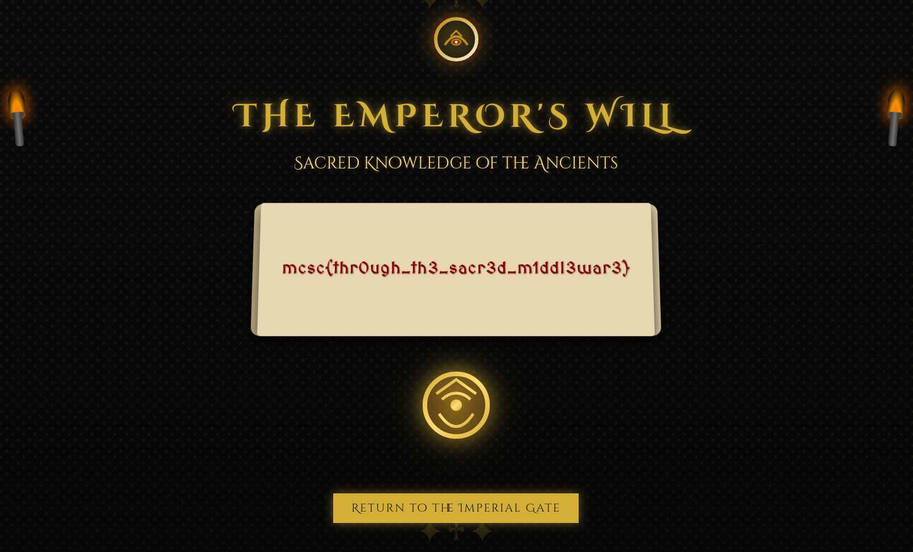

## Imperial Gate

- **Difficulty**: Hard
- **Category**: Web
- **Skills Required**: Web Security, Next.js Middleware, CVE Analysis, HTTP Headers, Docker

Long before independence, an Emperor of India concealed a sacred chamber deep within the heart of his fortress. It was said to hold ancient knowledge that could tip the scales in India's favor during the great struggle. After his death, the secrets were lost to time — until now.

Over the years, a mighty wall has risen around it — some call it the Gatekeeper, others the Firewall, the Middleware, or even the Final Barrier. No matter the name, all agree on one thing: it is strong and unbreakable…

...or... is it?

## Setup and Installation

To run the challenge locally using Docker:

1. Build the Docker container:
   ```bash
   docker build -t imperialgate .
   ```
2. Run the container:
   ```bash
   docker run -p 9090:3000 imperialgate
   ```
   The challenge will be available at [http://localhost:9090](http://localhost:9090)

## Hints

Oh we just confirmed, its not a Gatekeeper, neither a Firewall, nor a Barrier. Its a Middleware. But rumor has that its not supposed to be used this way. That recently they found a crack in it.

## Solution

<details>
<summary>Click to reveal solution</summary>

### Analysis Approach

1. Observe the challenge and note the Next.js version and middleware hints
2. Research CVE-2025-29927 and learn about the header-based middleware bypass
3. Identify that `/will` is protected by middleware and redirects to `/unauthorized`
4. Use the header `x-middleware-subrequest:middleware:middleware:middleware:middleware:middleware` to bypass the middleware
5. Access `/will` with the header to reveal the flag

### Step-by-Step Solution

#### Step 1: Access the Challenge

- Go to [http://challenges.mcsc.space:6969/](http://challenges.mcsc.space:6969/)
- Notice the "Enter the secret chamber" button redirects to `/will` but you are sent to `/unauthorized`

#### Step 2: Research the Vulnerability

- The challenge references "Middleware" and Next.js v14.0.0
- Find CVE-2025-29927 and read [this article](https://securitylabs.datadoghq.com/articles/nextjs-middleware-auth-bypass/)

#### Step 3: Bypass the Middleware

- Use a tool like Burp Suite, Postman, or browser extension to intercept the request to `/will`
- Add the header:
  ```
  x-middleware-subrequest:middleware:middleware:middleware:middleware:middleware
  ```
- Forward the request and you will see the flag

#### Step 4: View the Flag

- The flag is presented as an image:



</details>

## Author

Created by [psychoSherlock](https://github.com/psychoSherlock)
